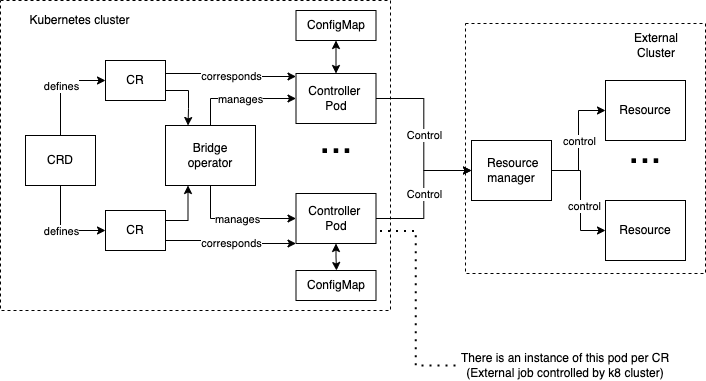

# Bridge Operator

The Kubernetes `Bridge` operator is able to submit and monitor long running processes on external systems which have their own cluster/resource manager, including SLURM, LSF and Ray. The implementation is agnostic to the choice of resource manager but assumes the system exposes a HTTP/HTTPS API for its control and management.

This operator can be deployed to submit traditional HPC cluster jobs but also to submit jobs to external systems such as: AI accelerators on dedicated clusters, heterogeneous HPC platforms, or Quantum systems.
We provide specific example `Pod` images for

- [`LSF`](pods/lsf): a `Pod` managing jobs inside an IBM Spectrum LSF Cluster
- [`Quantum`](pods/quantum): a `Pod` managing jobs inside the IBM Quantum Service
- [`SLURM`](pods/slurm): a `Pod` managing jobs inside a Slurm cluster
- [`Ray`](pods/ray): a `Pod` managing jobs inside a Ray cluster

---

## Overview

The Bridge Operator acts as a simple bridge between Kubernetes and the external system where visibility into the external system is limited to the system's HTTP(S) API requests.
As a result there is no interaction between the Kubernetes scheduler and the workload manager on the external system.

The operator consists of a Kubernetes controller with `Custom Resource Definitions` (CRDs), a `Pod` and `ConfigMap`.
Once the CR is deployed, the operator is responsible for:

- Validating input parameters - checking if `secret`s and other necessary Kubernetes resources specified in the CR exist.
- Creating the ConfigMap with application specific data from the CR Spec. The data is later utilized by the Pod when submitting the job.
- Creating the Pod that submits the HTTP/HTTPS requests to send the job to the external system.
- Reading the job's current state from the ConfigMap (updated by the Pod) and updating the CR status accordingly.
- Monitoring the Pod and other Kubernetes resources.
- Responding to reported errors in the external system.
- Cleaning up resources when the job is deleted.



---

## Prerequisites

The operator implementation depends on the [Operator SDK](https://sdk.operatorframework.io/docs/) which should be installed
on your machine. Installation prerequisites are [here](https://sdk.operatorframework.io/docs/building-operators/golang/installation/)
and include:

- git
- go version 1.18
- docker version 17.03+
- kubectl and access to a Kubernetes cluster of a compatible version.
  Installation procedures are described [here](https://sdk.operatorframework.io/docs/installation/)
  For Mac users, we recommend installing with [brew](https://brew.sh/).
  Tested with version v1.22.2

## Operator Implementation Details

The Operator's implementation presents a general way of managing Kubernetes resources to create a bridge between an external system and Kubernetes.

The code _crucial_ to submitting and monitoring any actual jobs on the external system is located inside the `Pod's` image.
A specific example image for a `Pod` managing jobs inside the [IBM Spectrum LSF workload management package](https://www.ibm.com/products/hpc-workload-management);
is given in [`lsf-pod`](pods/lsf).

The Operator defines a CRD `BridgeJob` which gathers information (required and optional) about the external job.
The operator's logic is implemented in the controller's `reconcile()` function and is used to create, and subsequently control,
the `ConfigMap` and the `Pod`. Both of which are created directly by the operator.

Additionally the operator leverages the following:

- A `Secret` with credentials needed to access the external system from the `Pod`. Assuming the external system requires authentication, the credentials are expected to exist in advance.
- An optional `Secret` with credentials needed to access an S3 object storage bucket used to store input or output files.

### Custom Resource Definiton `BridgeJob`

Here is a general overview of the CRD YAML with some defaults filled in. All fields can hold custom values.

```yaml
kind: BridgeJob
apiVersion: bridgejob.ibm.com/v1alpha1
metadata:
  name: mybridgejob
spec:
  resourceURL: http://mycluster.ibm.com:8080/platform/
  resourcesecret: mysecret
  imagepullpolicy: Always
  updateinterval: 30
  jobproperties:
    runlimit: 20 #  mins
  jobdata:
    jobScript: /home/batch.sh
    scriptlocation: remote
  s3storage:
    s3secret: mysecret-s3
    endpoint: minio-endpoint.us-south.containers.appdomain.cloud
    secure: false
  s3upload:
    bucket: mybucket
    files: 'output.txt'
```

#### CRD Status

| Field                   | Short description                                                            |
| ----------------------- | :--------------------------------------------------------------------------- |
| `status.jobstatus`      | Status of CR, should reflect status of job in external system                |
| `status.message`        | Message providing additional information for DONE/KILLED/FAILED/UNKNOWN jobs |
| `status.starttime`      | Start time from external system filled when job is in finished state         |
| `status.completiontime` | Completion time from external system filled when job is in finished state    |

`spec.jobproperties` is a map struct of common job properties which can be selected for the job in external system.

Possible job statuses :

- `PENDING`
- `RUNNING`
- `SUSPENDED`
- `DONE`
- `FAILED`
- `KILLED`
- `UNKNOWN`

`BridgeJob` is in a finished state when the`jobstatus` is in one of the `DONE`, `KILLED`, `FAILED`, or `UNKNOWN` states. 
When `BridgeJob` fails because of missing Kuberentes resources (or data in them), `status.message` is filled with a brief explanation.

---

### Reconciler

The controller's reconcile logic can be compared to a finite state machine, where every `BridgeJob` CR specifies a state and
actions specific to that state are performed. The possible states can be grouped into two categories as follows:

- finished: the job's state in the `ConfigMap` updated by the Pod is `Failed', 'Done', 'Killed', or 'Unknown`
- running: the job's state in the `ConfigMap` updated by the Pod is `Pending', 'Running', or 'Suspended`

At the beginning of reconciliation, the controller checks if `BridgeJob` is in a finished or running state. At the end of reconciliation,
`BridgeJob`'s state is updated according to the state in the shared `ConfigMap`.

#### Notes on S3

If the S3 secret name is not specified in `BridgeJob` yaml, no information regarding S3 will be propagated to the shared `ConfigMap`.

If the S3 secret name is specified but it does not exist in the `BridgeJob` namespace or information is missing
(either in `Secret` or in `BridgeJob` such as the S3 endpoint), then the CR will fail.

The `Pod` performs other checks, such as checking for valid credentials, bucket existence.


## Local Installation and Deployment


1. Clone this repository `git clone https://github.com/IBM/Bridge-Operator.git`
2. `cd operator`
3. To run:

   a) Locally outside the cluster

   - Locally from binaries
   - Deploy the CRD: `kubectl apply -f config/crd/bases/bridgejob.ibm.com_bridgejobs.yaml`
   - Edit the file `main.go`, for the `flag.BoolVar` as follows: (that is change `true` to `false`)

   ```golang
    flag.BoolVar(&enableLeaderElection, "leader-elect", false,
    "Enable leader election for controller manager. "+
    "Enabling this will ensure there is only one active controller manager.")
   ```

   - Then run the follwing command:
   - `make install run`

   b) Run as a Deployment inside cluster

   - Deploy the CRD: `kubectl apply -f config/crd/bases/bridgejob.ibm.com_bridgejobs.yaml`
   - `make deploy`

- From pre-built resources
  - Deploy all resources at once: `kubectl apply -f all.yaml`

---

NOTE: for running on a local Kind cluster comment out all lines in operator/config/prometheus/monitor.yaml before deploying the operator.


## Examples

For valid examples of `Secrets`, see `lsfsecret.yaml and s3secret.yaml` in `samples/core/secrets`.

For CR examples, see `samples/core/operator` and for tutorials see `samples/tutorials`.

---

## Build and Run

Before building, make sure `kustomize` is installed.

Clone this repository `git clone https://github.com/IBM/Bridge-Operator.git`. Then run the following commands:

```shell
cd operator
cd config/manager
kustomize edit set image controller=${IMG}:[NEW_VERSION]
cd ../../ # Back to the repo root directory
make docker-build docker-push IMG=${IMG}:[NEW_VERSION]
make deploy IMG=${IMG}:[VERSION] # Deploys controller to K8s cluster specified in ~/.kube/config
kustomize build config/default > all.yaml # Generates all resources that have been deployed
```
