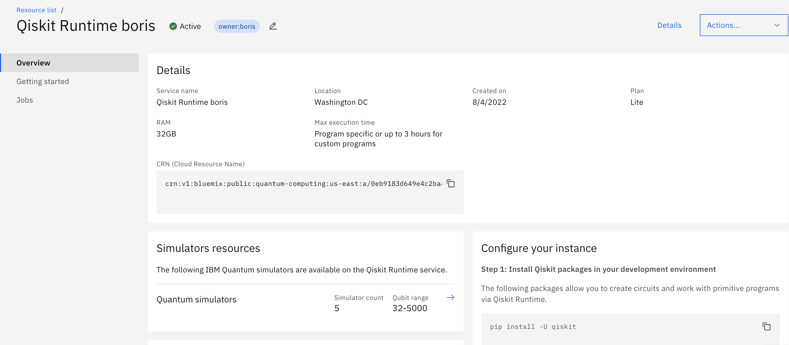
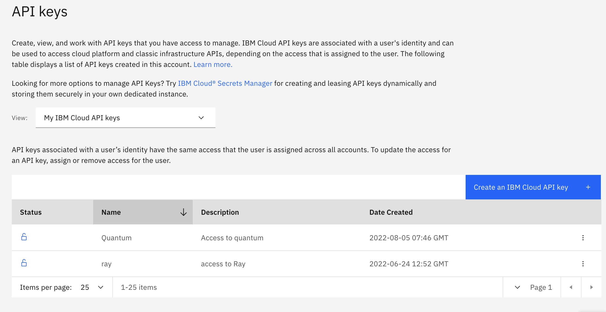

# Quantum pod

The `quantum-pod` is an example of submitting and monitoring a job to an external
[IBM Quantum Service](https://cloud.ibm.com/docs/quantum-computing) via the 
[`BridgeOperator`](../../operator).  

To use the pod first create a quantum service instance following the 
documentation [here](https://cloud.ibm.com/docs/quantum-computing?topic=quantum-computing-quickstart)
There are two plans available: Lite (simulators only) and standard (access to hardware devices)



As quantum services run in the IBM cloud, to use you need to have an IBM cloud account.
Authorization to the IBM Cloud services is enforced using an IBM Cloud Identity and Access Management (IAM)
To access the services you need an API key for authentication/authorization.

Create an API key, go [to](https://cloud.ibm.com/iam/apikeys)



Now you need to create [quantum service](https://cloud.ibm.com/catalog/services/quantum-services--experimental)

````
curl --request GET 'https://us-east.quantum-computing.cloud.ibm.com/programs' \
    --header 'Service-CRN: <YOUR-CRN>' \
    --header 'Authorization: apikey <YOUR-APIkey>'
````
An example of this request will look like

```
curl  --request GET 'https://us-east.quantum-computing.cloud.ibm.com/programs' \
    --header 'Service-CRN: crn:v1:bluemix:public:quantum-computing:us-east:a/b947c1c5a9378d64aed96696e4d76e8e:a3a7f181-35aa-42c8-94d6-7c8ed6e1a94b::' \
    --header 'Authorization: apikey 10e7b1b84e418eb903dbfa0760f9834fda745a236180ec234077019ea1ddc4181553508efd4cdd7782464cb120dbc735c2d2ab4f834ae9710b0a9eb0427fd4cd'
```

Quantum APIs accept and return data in JSON. Fortunately GO has a good support for [JSON](https://www.sohamkamani.com/golang/json/)
There are also structures for these jsons [here](https://github.ibm.com/IBM-Q-Software/ntc/tree/master/models)

The methods that the pod implements are:
* Generate tokens (see above)
* [Add program](https://cloud.ibm.com/apidocs/quantum-computing#create-program), if a program need to be uploaded - 
request `ProgramCreate`, reply `ProgramResponse`
* [List programs](https://cloud.ibm.com/apidocs/quantum-computing#list-programs), to get a program by name - 
request query param name, reply `ProgramsResponse`
* [Delete program](https://cloud.ibm.com/apidocs/quantum-computing#delete-programs-id), to delete program - cleanup
* [Run job](https://cloud.ibm.com/apidocs/quantum-computing#create-job), to run job - request `JobRunParams` 
reply `JobCreateResponse` 
* [Delete job](https://cloud.ibm.com/apidocs/quantum-computing#delete-job-jid), to delete job
* [List job details](https://cloud.ibm.com/apidocs/quantum-computing#get-job-details-jid), to get the status of the job
reply - `JobResponse`
* [List job results](https://cloud.ibm.com/apidocs/quantum-computing#get-job-results-jid), to get job results 

A small [test](cmd/quantumtest.go) demonstrates the basic capabilities of quantum services. Use it to validate that the service is working correctly.

## Implementation
The Quantum pod makes use of general pod utililty functions given [here](../utils/podutils.go). It submits a quantum job
and then monitors the execution. Once the job is complete, the results of the execution are uploaded to S3 (if required).

Example ConfigMap:

```
data:
  # operator poll interval
  updateInterval: "20"                                                  # Poll time
  # job execution
  resourceURL: https://us-east.quantum-computing.cloud.ibm.com/         # URL for cluster
  # execution script
  jobdata.jobScript: "hello-world"                                      # Script name
  jobdata.scriptLocation: remote
  jobdata.jobParameters: |
    {
      "params": {
        "iterations": 5
      }
    }
  jobdata.scriptExtraLocation: inline
  #S3
  s3.endpoint: {{MY_S3_ENDPOINT}}           #S3 endpoint
  s3.secure: "false"                                                              # S3 secure
  s3.secret: secret-minio                                                         # S3 secret

  s3upload.bucket: quantum                                                        # bucket
```

## Building Docker image

To build an image make sure that you are at the `pods`directory and run the following command:
````
docker build -t [name] . -f Dockerfile_quantum
````
Note that docker file in this case has to be in the pods directory, because it is loading both utils and quantum directories to the docker file

## Testing

See `/samples/tutorials`. 

The testing qiskit programs are from [here](https://github.com/Qiskit/qiskit-ibm-runtime/tree/main/docs/tutorials)
 
